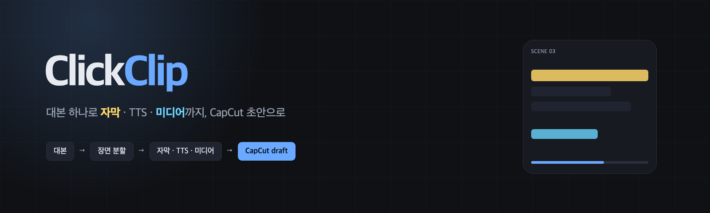
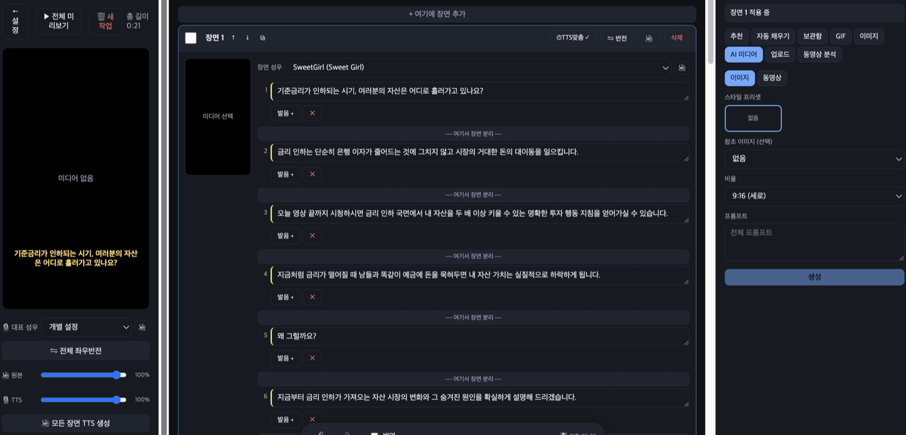
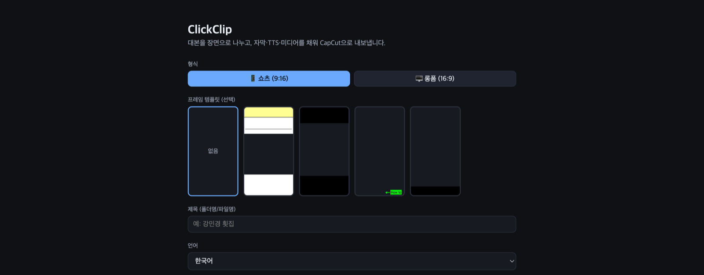

<p align="center">
  
</p>

<h3 align="center">대본 하나로 자막 · TTS · 미디어까지 채워 CapCut 초안으로 내보내는 쇼츠 제작 도구</h3>

<p align="center">
  <a href="#볼-만한-코드">볼 만한 코드</a> ·
  <a href="#실행">실행</a> ·
  <a href="specs/2.0.0_master_spec.md">명세</a>
</p>

<p align="center">
  
  
  
  
  
  
</p>

## 무엇을 하나

쇼츠 한 편을 만들려면 대본을 장면으로 나누고, 장면마다 자막을 넣고, 음성을 녹음하거나 생성하고, 어울리는
이미지나 영상을 찾아 붙이고, 그것을 편집기 타임라인에 올려야 합니다. ClickClip 은 이 반복 작업을 대본 입력
한 번으로 줄입니다. 결과는 CapCut 이 그대로 여는 초안(draft) 폴더로 나오고, 마무리 편집은 CapCut 에서
이어서 합니다.

**2026.05 ~ 08 · 단독 개발**

## 흐름

```
대본 입력 (직접 붙여넣기 또는 주제만 주고 Gemini 생성)
  → 1문장 = 1장면으로 분할
  → 장면마다 자막 2줄 · TTS(Typecast) · 이미지/영상(fal · Giphy · SerpAPI)
  → 글자 타임스탬프로 자막 타이밍 계산
  → CapCut draft 폴더로 내보내기
```

<p align="center">
  
  <br>
  <sub>편집 화면 — 왼쪽 미리보기, 가운데 장면별 자막 줄과 성우, 오른쪽에서 장면마다 AI 이미지 · GIF · 업로드 미디어를 고른다</sub>
</p>

<p align="center">
  
  <br>
  <sub>시작 화면 — 형식(쇼츠 · 롱폼), 프레임 템플릿, 언어를 고르고 대본을 붙여넣는다</sub>
</p>

## 구성 (도커 3컨테이너)

| 서비스 | 스택 | 포트 | 맡는 일 |
|---|---|---|---|
| frontend | React + Vite | 5173 | 대본 입력, 장면별 미리보기 · 교체 · 길이 조정 |
| backend | Node + Express + ffmpeg | 4000 | 에셋 관리, 타이밍 계산, CapCut draft 생성 |
| ai_server | FastAPI + ffmpeg | 8000 | 대본 생성 · 장면 분할 · 캐릭터 시트 · 이미지 프롬프트 · TTS · 샷 감지 |

## 볼 만한 코드

- **CapCut draft 를 스키마 없이 만든다** — CapCut 의 draft JSON 은 문서화되지 않은 참조가 얽혀 있어
  직접 쓰면 깨집니다. 사용자가 CapCut 에서 만들어 둔 골든 스켈레톤의 대표 세그먼트와 그것이 참조하는
  material 묶음을 새 UUID 로 통째로 복제한 뒤 가변부만 바꿉니다. 가로 스켈레톤을 1080×1920 으로 다시
  맞추는 것까지 빌드 때 합니다. → [`backend/src/lib/capcut/draftBuilder.js`](backend/src/lib/capcut/draftBuilder.js)
- **LLM 이 원문을 고치지 못하게** — 대본을 장면으로 나눌 때 공백을 뺀 글자 순서가 원문과 같아야 통과합니다.
  누락이나 수정이 있으면 결과를 버립니다. 캐릭터 등장 장면 비율도 지시문이 아니라 코드로 상한을 겁니다.
  → [`ai_server/app/services/longform.py`](ai_server/app/services/longform.py)
- **자막 타이밍은 한 곳에서** — 장면 TTS 를 줄 단위가 아니라 한 번에 합성하고, 글자별 타임스탬프로 각 줄의
  시작을 계산합니다. 프론트 미리보기와 백엔드 내보내기가 같은 식을 씁니다.
  → [`backend/src/lib/timing.js`](backend/src/lib/timing.js)
- **이름 규칙 변환은 두 경계에서만** — 프론트(camelCase)와 AI 서버(snake_case)가 다르므로 프론트 API
  클라이언트와 백엔드 미들웨어에서만 바꾸고 나머지는 손대지 않습니다.
  → [`backend/src/middleware/caseConvert.js`](backend/src/middleware/caseConvert.js)

## 실행

```bash
cp .env.example .env      # Gemini · Typecast · fal · Giphy · SerpAPI · GCP 키
docker compose up --build
```

프론트 http://localhost:5173 · 백엔드 http://localhost:4000/health · AI http://localhost:8000/health

## 사용자 리소스

`resources/` 아래 폴더를 Finder 에서 직접 관리합니다 (bind mount).

| 폴더 | 내용 |
|---|---|
| my_templates | 프레임 오버레이 png (알파 필수) |
| my_samples | AI 참조 이미지 |
| my_styles | 스타일 프리셋 txt(프롬프트) + jpg(예시) 짝 |
| my_voices | 보이스 미리듣기 mp3 |
| capcut_template | CapCut draft 골든 스켈레톤 (`draft_info.json` · `draft_meta_info.json`) |
| fonts | 자막 폰트 |
| gcp | Video Intelligence 용 `credentials.json` |

산출물은 `data/workspace`(에셋) 와 `data/capcut_drafts`(내보내기 결과) 에 쌓입니다.

## 만든 사람

**이승욱** · coms1768@gmail.com · 2026.05 ~ 08 · 기획 · 프론트엔드 · 백엔드 · AI 서버 단독
